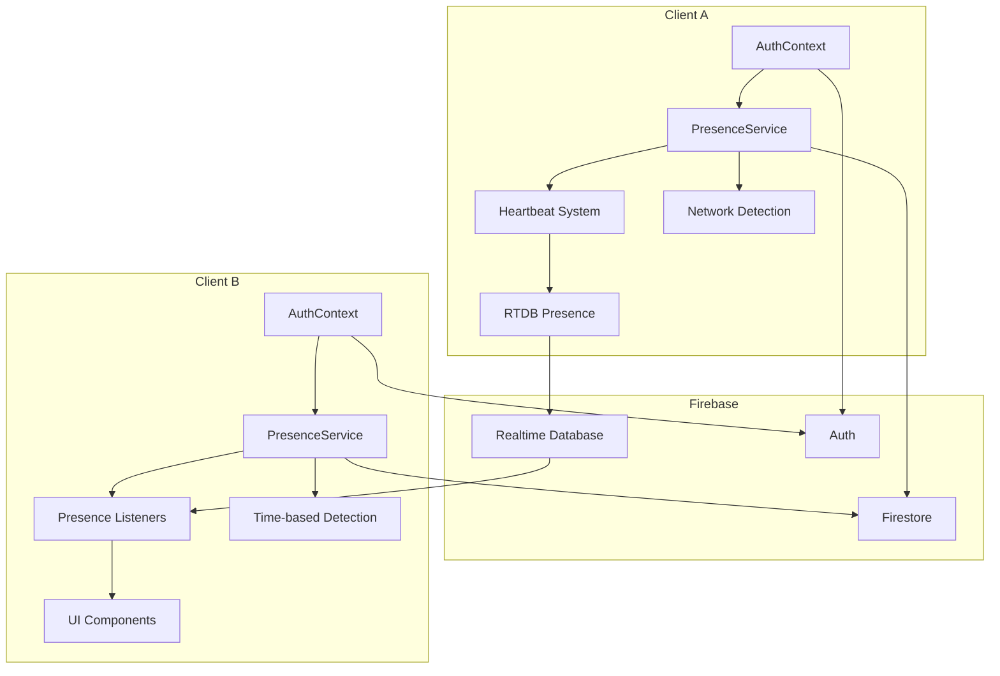
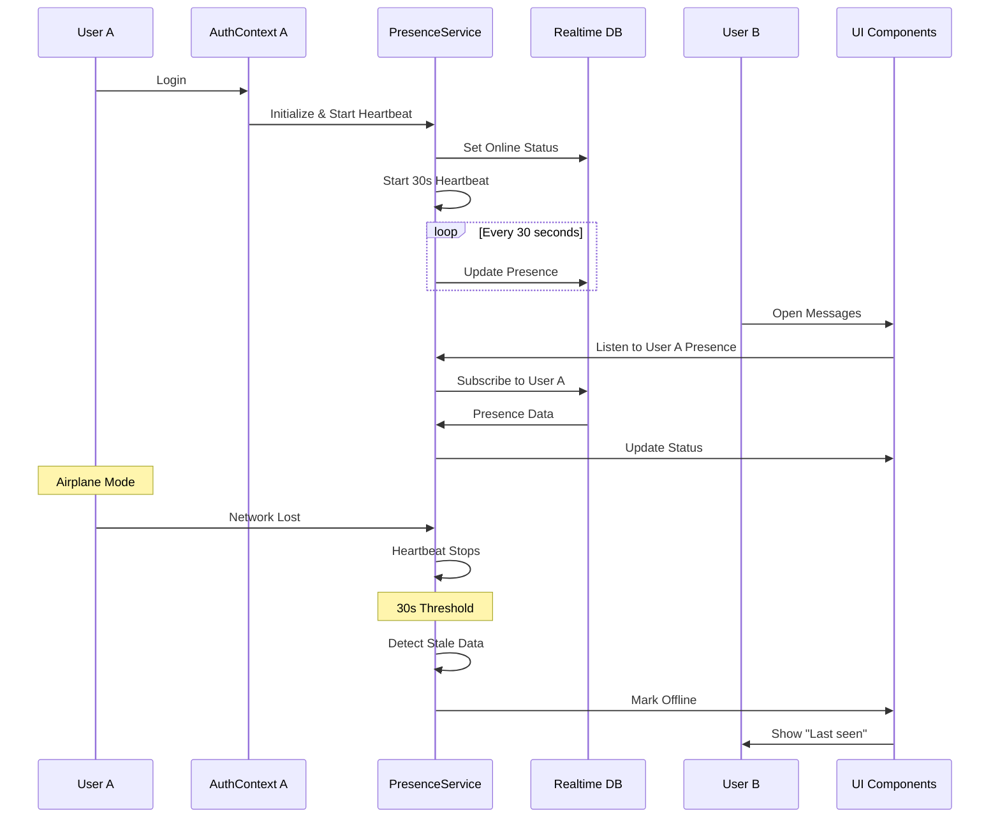
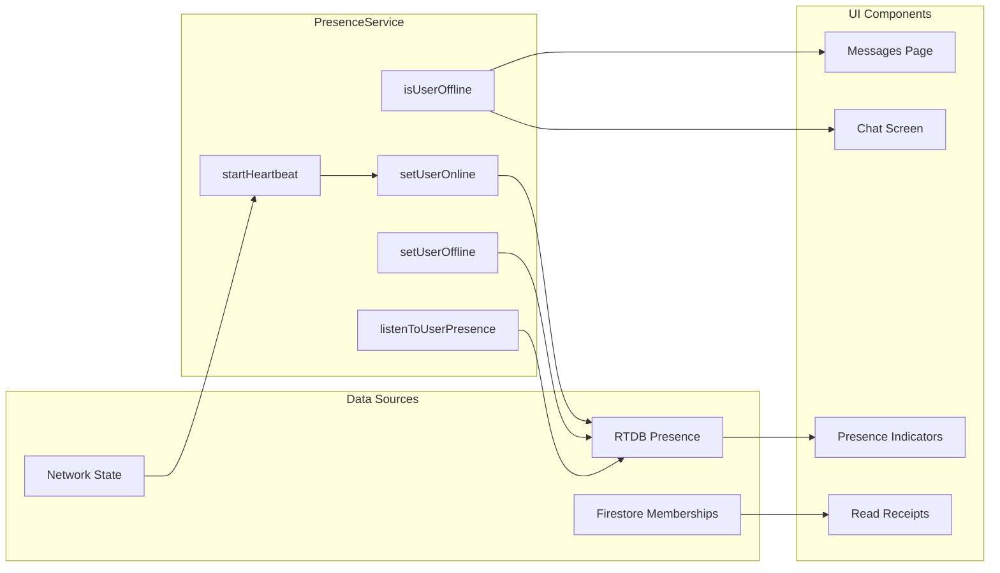
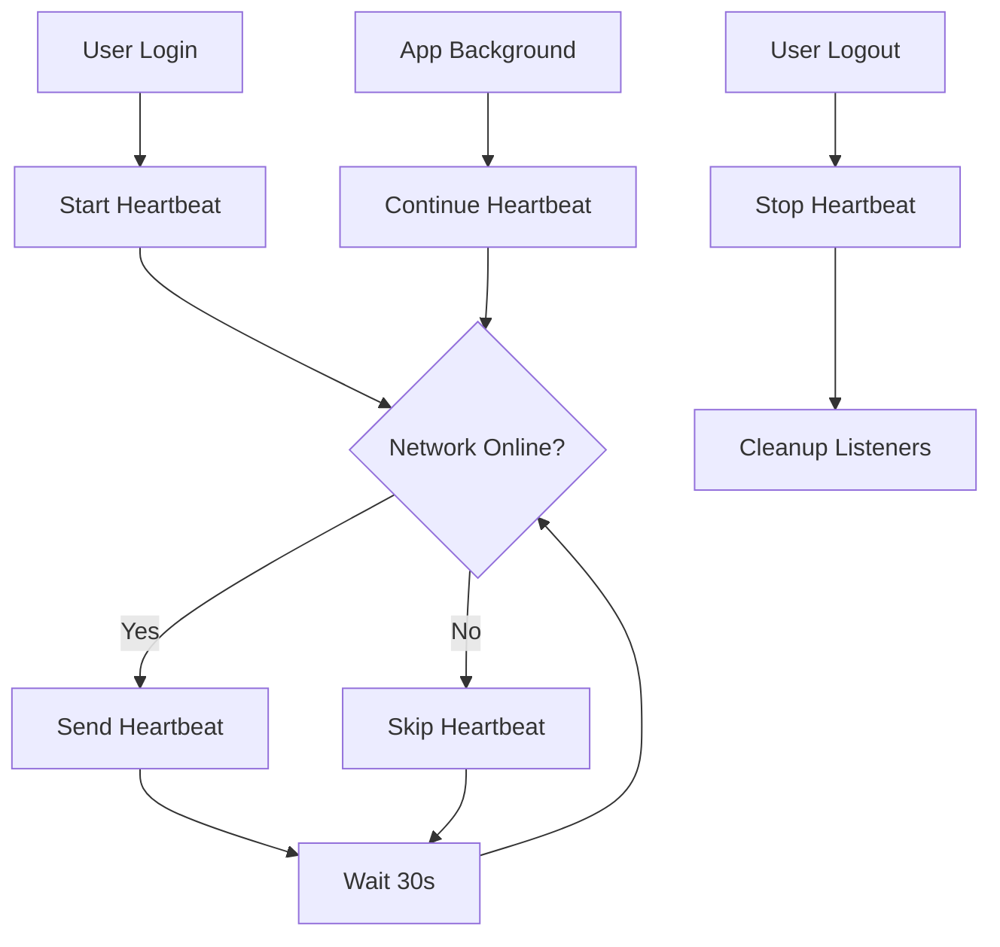
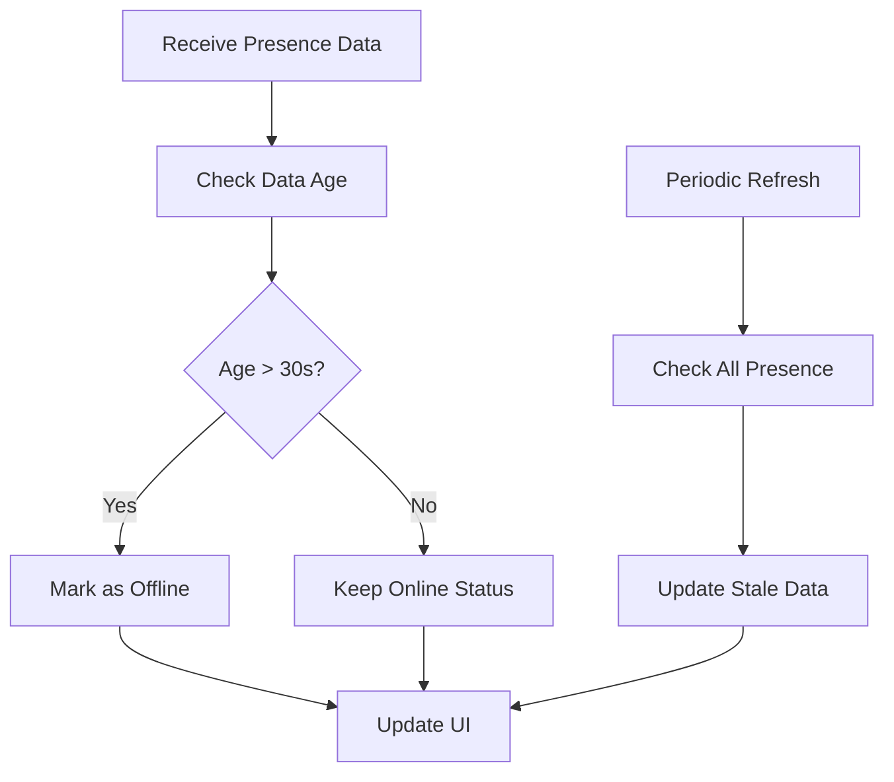
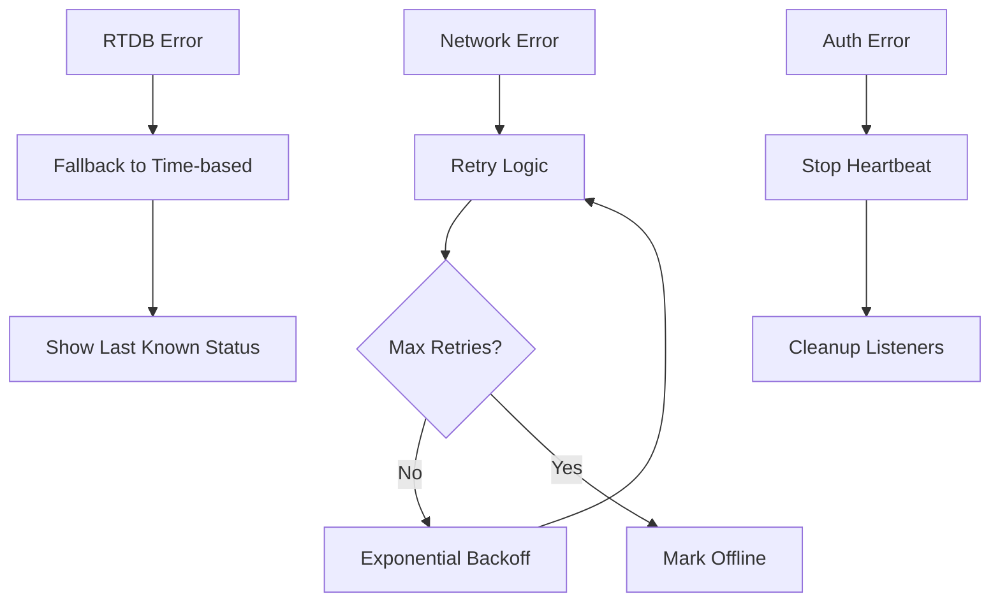
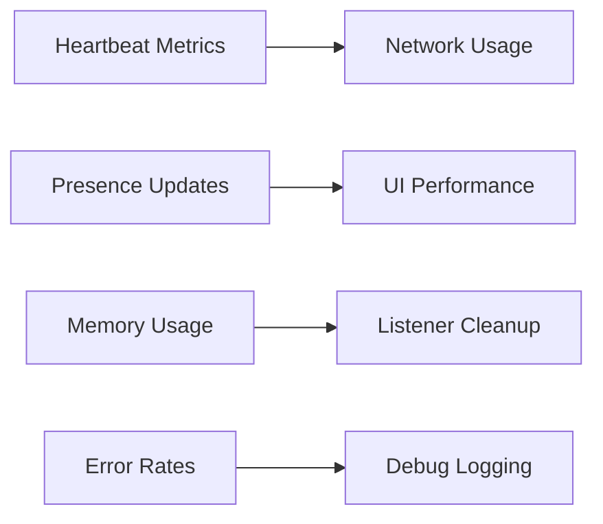

# Presence System Architecture

## System Overview

## Data Flow Diagram

## Component Interaction

## Heartbeat System Flow

## Time-based Detection Flow

## Error Handling

## Performance Monitoring

This architecture documentation provides a comprehensive view of how the presence system works, including data flow, component interactions, and error handling scenarios.
